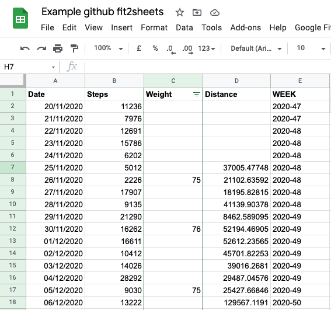

# A script to automatically append google fit data to google sheets.
Runs using google scripts so no need to host anything

vauge instructions that may be missing a step or two:

Create or open a spreadsheet in Google Sheets. Have a tab called "History"
Select the menu item Tools > Script editor.
Delete any code in the script editor. 

create a project on https://console.developers.google.com
go to API & services -> credentials
get your ClientID and secret

go to https://script.google.com/home
make a new project, add the code from application.js and modify to add your credentials. Addit to the script editor.
in the project add the oAuth2 library

set a trigger that is time based on the function getMetrics that runs everyday, 5am will do. 

getHistory()  can be called to full up old data, you will have to modify this to run in batches.

An example excel can be seen here with some pivot tables e.t.c
https://docs.google.com/spreadsheets/d/1mkDwvPz0YETKafxNW2DiwnZtPl_klGVGmwY71UBLd10/edit?usp=sharing

